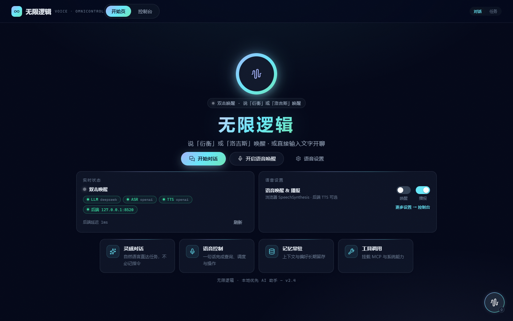

# 无限逻辑 · 语音全控智能体

用语音（或文字）控制电脑上的一切：唤醒 → 说话 → 意图判断 → 任务编排（澄清/确认/执行/汇报）→
多智能体协作 + 工具执行 → 记忆/RAG 上下文。浏览器端本地 VAD 分段 + 本地 KWS 唤醒判定 +
轻量 Python 后端（FastAPI），OpenAI 兼容接口，支持离线/在线任意部署。

> 自研编排状态机（不依赖 LangGraph/CrewAI）、多智能体协调、长期记忆 + RAG、MCP 桥接、
> Skills 技能包、cron 定时任务、GUI/Shell/文件系统执行层。更新历史与验收清单见
> [docs/updates.md](docs/updates.md)。



> 开始页：说「衍衡」或「洛吉斯」唤醒，或直接输入文字。截图由 `cd web && npm run shot` 生成。

## 功能

| 模块 | 功能 |
|------|------|
| 悬浮球助手 | 右下角可拖拽悬浮球，语音对话 + 聊天气泡面板 + 迷你播放条 |
| 语音唤醒 | **VAD → 本地 KWS → ASR** 三层链路：浏览器本地 VAD 切段 → 后端 sherpa-onnx KWS 本地判定唤醒词**「衍衡」/「洛吉斯」**（发音级/拼音级，同音字免疫）→ 命中才调云端 ASR 抬指令。背景声/闲聊被 KWS 就地丢弃，**不出本机、不上云、不花钱** |
| 唤醒模式 | `auto`/`local`（KWS 闸门 + ASR）、`cloud`（旁路闸门纯云端，最大召回）、`webspeech`（浏览器识别兜底），设置页/配置切换 |
| 语音输入 | ASR（OpenAI 兼容）转文字；语音作答提问（播报完直接开口答，不必再喊唤醒词） |
| AI 对话 | LLM（OpenAI 兼容：DeepSeek / OpenAI / 通义…）多 profile 切换，ReAct 工具调用 |
| 任务编排 | 意图判断（闲聊/任务）→ 任务形成 → 澄清缺失信息 → 操作确认（**默认已放行**，见「安全」节）→ 执行 → 汇报（SSE 实时） |
| 消息块协议 | 对话内容模块化：思考 / 工具 / 正文（代码/文档/图片）/ 提问作答 / 回合汇总卡等独立块渲染，注册协议可扩展（ext:*），思考过程可折叠查看 |
| 多智能体 | 复杂任务自动拆解：规划 / 执行 / 检索 / 批评 子代理并发协作（可开关） |
| 工具执行 | 27 个内置工具：搜索/天气/计算/文件/Shell/Python/GUI/记忆/定时/技能，@tool 自动注册 |
| 长期记忆 | 事实记忆（SQLite FTS5 全文检索）+ 任务后 LLM 自动提取 + RAG（BM25）检索注入上下文 |
| 任务知识库 | 任务模式下完成时询问「完成了吗」，答「完成了」才存档成功任务；下次相似任务按**用户原话**检索历史参数预填、减少重复询问（控制台「任务库」可浏览/删除） |
| MCP 桥接 | 启动时连接外部 MCP server，工具动态注册进注册中心（mcp_<server>_<tool>） |
| Skills 技能包 | skills/*.yaml 热加载，{{param}} 填参逐步骤执行 |
| 定时任务 | cron（5 段）注册，到点无人值守执行（需澄清/确认的自动跳过） |
| 环境感知 | 采集系统信息写入 environment.md，注入规划上下文，工具参数贴合真实系统 |
| 全链路可控 | 任意时刻可停止整个任务/当前步骤（CancellationToken 贯穿到子进程，taskkill /T 兜底） |
| 安全审计 | 非 localhost 绑定强制 API Token；工具执行与高风险确认写入 data/audit.log；每次云端音频上传记账可查 |
| 语音播报 | 浏览器 SpeechSynthesis API 播报助手回复（可选后端 TTS） |
| 设置面板 | 控制台「设置」页：切换服务商 profile / 调节参数 / 设密钥（不回显）/ 检测连接，热重载即时生效 |

## 快速开始

```bash
# 1. 安装 Python 依赖（需要 Python 3.14+）
pip install -r requirements.txt
# 或双击 install_deps.bat — 在线优先，失败自动回退 scripts/libs/ 离线 wheel
#   （离线包按 Python 3.14 / win_amd64 打包，见 requirements.txt 顶部说明）

# 2. （可选，推荐）下载本地 KWS 唤醒模型 —— 3.3MB，缺它时唤醒自动回退云端判定
#    下载地址见 requirements.txt 中 sherpa-onnx 段注释，解压到 models/ 下

# 3. 配置（非敏感配置与密钥分离）
cp config.yaml.example config.yaml
cp config.secrets.yaml.example config.secrets.yaml
# 编辑 config.yaml（endpoint/model/多 profile 等非敏感项）与 config.secrets.yaml（密钥，不入库）。
# 密钥优先级：环境变量 > config.secrets.yaml：
#   set LLM_API_KEY=sk-...      # LLM（deepseek）
#   set ASR_API_KEY=sk-...      # ASR（MiMo 等 OpenAI 兼容服务）
#   set TTS_API_KEY=sk-...      # 后端 TTS（可选；默认浏览器本地语音播报）
# 配置也可在网页控制台「设置」页编辑（切换模型/调参/设密钥/检测连接，大部分即时生效）。

# 4. 启动（一键：前端 + 后端）
python main.py serve                  # 浏览器自动打开 http://127.0.0.1:8520
```

`python main.py serve` 同时提供前端页面（`web/dist`）与 `/api/*` 接口，打开一个端口即可使用。

**一键启动脚本**（Windows，含 LLM/ASR 连通性检查）：

```bat
start.bat
```

> 若 `web/dist` 未构建，前端需另行构建：

```bash
cd web
npm install
npm run build        # 产物在 web/dist/，serve 即托管该目录
```

开发模式（前端热更新）：

```bash
cd web
npm install && npm run dev     # 访问 http://127.0.0.1:5173 （vite 代理 /api → 8520）
```

## 语音助手使用

启动前端后，页面右下角出现可拖拽的悬浮球：

- **双击悬浮球** 或点击球上的 mic 徽章启动语音唤醒（再次点击关闭）
- 两种说法都支持：
  - **一句话说完**：说「衍衡，帮我查天气」——提示音后由后台提取指令，直接起一轮
  - **只喊唤醒词**：说「衍衡」→ 提示音 → 再说指令；唤醒后 8s（`vad.answer_timeout_ms`）内没
    说话则作废，不会把之后无关的一段当成指令
- 唤醒词是 **「衍衡」** 或 **「洛吉斯」**（**发音级判定**：ASR 写成任何同音字——燕恒/言恒/
  演横——都命中；拼音严格相等，「也行」「若」等近音词不会误触发）
- **判定本地完成**（sherpa-onnx KWS，毫秒级）：没说唤醒词的音频（电视声/闲聊）在本机直接丢弃，
  不上传、不花钱；说中唤醒词才调云端 ASR 抬取指令文本
- 录音 **VAD 静音检测自动停止**（默认静音 1.5s），最长 10s 上限；过短的段直接丢弃不上传
- **语音回答提问**：助手提出需要确认/澄清的问题并播报完后，**直接开口说答案即可**（不必再说唤醒词）；
  能被选项回答的问题可说出选项文案（先按 **trim 后精确相等**匹配选项，不命中则当自由文本处理）；
  也可继续用界面按钮/输入框作答
- **确认的语音作答**：说「是的，允许本次」「确认执行」「执行吧」「可以」这类自然表达都能被批准 ——
  判定分三层：界面按钮（结构化选择，权威）→ 精确字面量 → **LLM 兜底**（只喂你这一句，不带对话上下文；
  除明确批准外一律拒绝）。犹豫、含糊、答非所问一律不放行
- **无应答进待机**：等待回答期间若一直没说话，超过 `vad.answer_timeout_ms`（默认 8s）进入待机；
  待机时唤醒词仍生效，说唤醒词可**回到刚才那个提问**继续作答，而不是开新一轮
- **播报期间暂停监听**：助手说话时会停掉分段录音器并**释放麦克风轨道**，播完恢复；
  播报结束后 1.2 秒内音频整体丢弃（**回声护栏**——助手自称「衍衡」，防止它自己的声音被误唤醒）
- 说出「停止 / 取消 / 暂停」等命令词可中断当前任务
- **对话 / 任务模式**：控制台头部 `[对话][任务]` 开关切换（localStorage 持久化）。
  **对话**（默认）少打断、完成不询问；**任务**模式会在任务完成后询问「这个任务完成了吗？」，
  答「完成了」才把该任务存档进任务库，下次相似任务自动预填参数减少询问

**唤醒模式**（设置页「语音」或 `config.yaml` 的 `voice.wake_word`）：

| 模式 | 行为 |
|------|------|
| `auto`（默认）/ `local` | KWS 本地判定前置闸门 + 云端 ASR 抬指令（背景声不上云） |
| `cloud` | 旁路 KWS，纯云端判定（最大召回，每次人声段都上云） |
| `webspeech` | 浏览器 Web Speech API 兜底（不依赖后端 ASR 配置） |

唤醒词、静音阈值、KWS 灵敏度等可在 `config.yaml` 的 `voice.wake_word` / `voice.vad` /
`voice.kws` 中调整。KWS 模型缺失时闸门自动旁路回退云端判定，不阻塞唤醒。

> **桌面端说明**：桌面原生悬浮球（PySide6）与本地常驻语音监听已暂停开发，桌面代码迁移至
> `desktop-ball` 分支（不再回迁）。当前语音交互由浏览器端 VAD/悬浮球与后端承担。

## 架构总览

```
┌──────────────────────────────────────────────────────────────┐
│  交互层  浏览器悬浮球(Vue3 + 本地 VAD) · 消息块渲染 · ASR/TTS  │
├──────────────────────────────────────────────────────────────┤
│  唤醒层  VAD 切段 → KWS 本地判定(sherpa-onnx) → ASR 抬指令      │
├──────────────────────────────────────────────────────────────┤
│  编排层  Orchestrator:会话状态机 → 意图 → 任务 → 澄清 → 确认    │
│          → 执行(ReAct) → 汇报 ；SSE 实时推送                   │
├──────────────────────────────────────────────────────────────┤
│  智能层  多智能体(规划/执行/检索/批评) · LLM 多协议多 profile    │
│          · 记忆/RAG 注入 · MCP 桥接 · Skills                   │
├──────────────────────────────────────────────────────────────┤
│  执行层  Shell(可 kill 进程树) · Python(独立进程) · 文件读写      │
│          · GUI 自动化 · 记忆存取 · 定时任务                     │
└──────────────────────────────────────────────────────────────┘
```

一次输入的处理链路：

```
语音（VAD 切段 → KWS 本地判定 → ASR）或文字输入
  → 意图判断（闲聊 | 任务）
  → 闲聊：LLM 直接回复
  → 任务：form_task（目标/参数/风险）→ 缺参数则澄清追问
  → 按权限策略确认（默认放行，仍播报计划）→ 执行（单代理 ReAct / 多智能体）
  → SSE 实时汇报（状态/思考/工具/正文/提问/汇总）→ TTS 播报
```

## API 端点

| 方法 | 路径 | 说明 |
|------|------|------|
| GET | `/api/ping` | 健康检查 |
| GET | `/api/config` / `/api/config/full` | 配置（full 含 profile 结构） |
| PATCH | `/api/config` | 更新配置并热重载 |
| PUT | `/api/config/secrets` | 设置密钥（不回显） |
| GET | `/api/detection` | 聚合检测（环境/配置/连通性） |
| POST | `/api/voice/wake/check` | 本地 KWS 快检（毫秒级、零云端调用） |
| POST | `/api/voice/wake` | 唤醒检测（转写 + 判定 + 切指令） |
| POST | `/api/voice/transcribe` | 纯转写（指令/作答段） |
| POST | `/api/voice/utter` | **编排入口**（SSE 事件流，`mode`: chat/task） |
| POST | `/api/voice/answer` | 投递提问回答（可带 qid 配对） |
| POST | `/api/tts` | 后端 TTS 合成（可选） |
| GET/POST | `/api/tools` `/api/tools/call` | 工具列表 / 执行（高风险需 confirm） |
| GET/DELETE | `/api/memory` | 长期记忆读取 / 删除 |
| GET/POST/DELETE | `/api/schedules` 等 | 定时任务管理 |
| GET/POST/PATCH/DELETE | `/api/sessions` 等 | 会话管理（历史/归档/重命名） |
| POST | `/api/task/{session_id}/stop` | 停止整个任务 |

完整 schema 见 `GET /openapi.json`（`web/src/api/generated.ts` 由其生成）。

## 命令

```
start.bat                   一键启动（Windows，含 LLM/ASR 连通性检查）
python main.py serve        启动 Web 服务（前端 + 后端 API）
python main.py check        聚合检测（环境 / 配置 / LLM·ASR·TTS 连通性）
```

## 测试

```
python -m pytest tests/ -q      # 后端单元测试（编排 / 工具 / 记忆 / RAG / MCP / Skills / 定时 / API）
python -m mypy core/ server.py  # 后端静态类型检查
cd web && npm run build         # 前端类型检查（vue-tsc）+ 生产构建
cd web && npm test              # 前端单元测试（Vitest）
```

唤醒判定的前后端语义由共享测试向量（`tests/data/wake_vectors.json`）在 pytest 与 vitest
双端共同钉住——改任一侧匹配规则，两侧测试必须同时变绿。

### 前后端类型共享（openapi-typescript）

全部 JSON 端点均以 `response_model`（pydantic，见 `core/api/schemas.py`）声明 → FastAPI 自动生成
openapi.json → 前端 `openapi-typescript` 生成 `web/src/api/generated.ts`；`web/src/types.ts` 与
`web/src/api.ts` 的 **API 类型全部 re-export generated**（单一事实来源：后端 schema 改动 →
前端类型同步，避免手写漂移）。

**SSE 事件**（`/api/voice/utter`）不经 openapi：由 `core/orchestrator/events.py` 定义 pydantic
事件模型，前端 `web/src/types.ts` 手写对应类型，`api.ts` 的 streamUtter 类型化解析。

```bash
cd web && npm run gen:api   # 导出 openapi.json + 重新生成 generated.ts
```

修改后端响应模型后需重跑 `gen:api`；`generated.ts` 入库，`openapi.json` 为中间产物（gitignore）。

## 配置

配置采用 **pydantic 强类型校验 + 双文件分离**（非敏感配置 / 密钥独立存储），保留多 profile YAML 结构：

- `config.yaml`：非敏感结构（llm / voice / server / mcp / rag / agent / llm_client / tools），
  **不含任何密钥**。加载时经 pydantic 模型校验（写错启动即报错）。多 profile（deepseek /
  openai / qwen / xiaomi-mimo…）改 `active` 切换。
- `config.secrets.yaml`：密钥独立存储（`llm/asr/tts.api_key`、`server.api_token`），不入库；
  环境变量优先级更高。
- `voice.wake_word`：唤醒词（可多个）与开关；`voice.vad`：静音切段参数；
  `voice.kws`：本地 KWS 闸门（模型目录 / 检测阈值）。
- `agent`：`recursion_limit`（ReAct 步数上限）、`multi_agent`（复杂任务是否转多智能体协调者）、
  `auto_approve`（write/exec 免确认开关）。
- `llm_client`：重试 / 熔断参数。
- `mcp.servers`：MCP server 列表（`{name, command, args}`），启动时自动连接并注册工具。
- `server.api_token`：非 localhost 绑定时的 API 访问令牌（留空则拒绝非 localhost 启动）。
- `server.cors_origins`：允许跨域的前端来源（默认空 = 禁止跨域）。
- `rag.auto_index`：启动时按需重建 RAG 索引（默认 true）。

**网页设置页**：控制台「设置」tab 可切换服务商 profile、调节参数、设置密钥（不回显）、检测连接；
保存后大部分配置**热重载即时生效**（LLM/ASR/TTS/唤醒词/参数），服务器绑定 / MCP 类变更需重启。

## 安全

- **绑定与令牌**：默认只绑定 `127.0.0.1`。将 `server.host` 改为非 localhost 地址时，必须设置
  `server.api_token`（否则拒绝启动）；此时所有 `/api/*` 请求需携带 `X-API-Token` 请求头。
- **CORS**：`server.cors_origins` 默认空 = 禁止跨域；本地同源/开发代理（vite 代理 /api）无需配置。
- **密钥零落库**：`config.yaml` 不含密钥，密钥在 `config.secrets.yaml` / 环境变量；API 永不回显密钥值，
  设置页只报「已设置 / 未设置」。
- **无沙箱 + 权限策略（默认已全放行）**：工具是否需要操作者确认由 `permissions` 策略决定
  （设置页「权限」可改）。**默认三档全放行**——即默认**不询问**：`run_shell_tool` 可执行
  任意命令、`write_file` 可覆盖任意文件。收紧方式：把某档改回 `ask`，或加 `deny` 规则
  （按工具名 glob 匹配，deny 单调短路、不可被后续规则翻案）。策略求值顺序：未注册工具 →
  拒绝；任一 `deny` 短路；首条匹配规则；层级默认；`default_action`。计划级确认与逐工具确认
  共用同一份 `permissions`；放行时**仍会播报计划**，只是不阻塞等待。无人值守（定时任务）
  无确认通道时高风险调用一律拒绝。**全放行等于这道闸门默认不生效**，请确认你接受该风险。
- **语音隐私边界**：
  - **本地 KWS 闸门（默认开启）**：唤醒判定在本机完成（sherpa-onnx），**没说唤醒词的音频
    （电视声/闲聊）在本机直接丢弃、不出本机、不上云**；只有 KWS 听到唤醒词的那段才上传云端
    ASR 抬取指令文本。`cloud` 模式（设置页可切）旁路闸门——每次人声段都上云，最大召回。
  - 上传即记账（`data/audit.log`）：`audio-upload via=wake|transcribe` 为真正上云的音频
    （含转写文本前 80 字），`kws-gate hit/skip=` 为本地判定记账（非上传）。
    `grep -c 'audio-upload via=' data/audit.log` 即云端上传总次数，供自查调用量与成本。
  - 关闭语音唤醒（再次点 mic 徽章）即停止取麦；助手播报期间麦克风被释放，播报结束后
    1.2 秒内音频丢弃（回声护栏）。
  - 不接受任何音频出本机：把 `voice.wake_word.enabled` 设为 `false`，改用文字输入。
- **审计**：工具执行与高风险确认决策写入 `data/audit.log`（独立于 agent.log）。
- **凭据/环境**：`config.secrets.yaml`、`environment.md`（含本机信息）不入仓库；`package_deploy.bat`
  打包时只带 `config.yaml.example` / `config.secrets.yaml.example` 模板，不含任何密钥。

## 工具扩展

工具由**后端 `@tool` 注册中心**管理（`core/tools/`），前端只负责展示工具时间轴，
新增能力无需改动前端。工具分三类风险等级：`read` / `write` / `exec` —— 三者**默认均免确认**
（见「安全」节），需要询问时在 `permissions` 里把对应层级改回 `ask`。

内置工具：

| 类别 | 工具 |
|------|------|
| 基础 | `grep_file` `find_files` `read_file` `write_file` `parse_doc` `list_dir` `stat_path` `system_probe` |
| 执行 | `run_shell_tool` `run_python_tool`（超时/流式/可 kill，独立子进程） |
| 检索 | `web_search`（ddgs）`get_weather`（wttr.in 免 key）`get_datetime` `calculate`（AST 白名单求值） |
| 记忆 | `memory_get` `memory_put` |
| 定时 | `register_schedule` `list_schedules` `remove_schedule` |
| 技能 | `list_skills` `run_skill_tool` |
| GUI | `gui_activate_tool` `list_windows_tool` `gui_click_tool` `gui_type_tool` `gui_screenshot_tool`（懒加载优雅降级） |
| MCP | 动态注册 `mcp_<server>_<tool>`（需配置 `mcp.servers`） |

新增一个工具只需三步：

1. 新建 `core/tools/xxx.py`，用 `@tool("描述", risk="read|write|exec")` 装饰函数；参数带类型注解，
   schema 自动推导（同步/异步均可）。
2. 在 `core/tools/__init__.py` 中 `import` 该模块触发注册。
3. 重启服务，LLM 会自动发现并调用新工具。

## 目录结构

```
无限逻辑-语音全控智能体/
├── main.py / server.py        入口 + FastAPI 装配（lifespan + 认证 + 静态托管 + 挂载路由）
├── start.bat / install_deps.bat / package_deploy.bat
├── config.yaml.example        非敏感配置模板（不含密钥）
├── config.secrets.yaml.example 密钥存储模板（复制为 config.secrets.yaml，不入库）
├── requirements.txt           Python 依赖（在线 / 离线 scripts/libs/ 双路）
├── mypy.ini                   后端静态类型检查配置
├── models/                    KWS 唤醒模型（不入库，下载见 requirements.txt；缺失自动旁路）
├── core/
│   ├── config/                配置包：schema（pydantic 模型）/ loader（YAML+密钥注入）/ runtime（单例+热重载）
│   ├── logger.py              loguru 日志 + 审计（data/audit.log）
│   ├── detection/             检测域：environment / validator / connectivity
│   ├── api/                   API 路由（voice / tools / memory / schedule / settings / sessions / state）
│   ├── llm/                   LLM 客户端（stream.py SSE 解析 / client.py 重试+熔断+连接池）
│   ├── voice/                 ASR / TTS + 唤醒：wake.py（拼音级判定）/ pinyin.py / kws.py（本地 KWS 闸门）
│   ├── orchestrator/          编排层：blocks（消息块协议）/ events（SSE 契约）/ session / intent /
│   │                          task / clarify / confirm / executor / control / pipeline
│   ├── agent/                 base 子代理基座 + coordinator 多智能体协调者
│   ├── tools/                 @tool 注册中心 + 内置工具
│   ├── execution/             shell（可 kill 进程树）/ python（独立进程）/ fs / gui
│   ├── memory/                长期事实记忆（FTS5）+ 任务后提取 + 上下文注入
│   ├── rag/                   索引（分块）+ 检索（BM25）
│   ├── mcp/                   外部 MCP server 客户端（stdio）+ 生命周期
│   ├── skills/                技能包加载（热重载）+ 执行
│   └── scheduler/             cron 定时 + 无人值守执行
├── skills/                    技能定义（YAML，文件名 = 技能名）
├── tests/                     pytest 单元测试（+ data/wake_vectors.json 唤醒共享测试向量）
├── docs/
│   └── updates.md             更新历史与验收清单（人工验收 / 语音验收台 / 成本实测）
├── web/                       Vue3 + Vite + TS 前端
│   ├── scripts/               辅助脚本（verify-voice.mjs 语音验收台 / screenshot.mjs）
│   └── src/
│       ├── blocks/            消息块协议：types / registry / normalize（事件→块流）/ speech（TTS 管线）
│       ├── components/blocks/ 块组件（Thinking/Tool/Text/Code/Question/Answer/Notice/Summary/…）
│       ├── components/        FloatingAssistant（悬浮球）+ assistant/ + console/ + ui/
│       ├── composables/       store / useChat / useTts / useWakeWord
│       │   └── wake/          唤醒编排：wakeOrchestrator / wakeChain / cloudAsrProvider /
│       │                      sherpaKwsProvider / webSpeechProvider
│       └── views/             StartPage.vue / ConsolePage.vue
└── data/                      运行时数据（agent.log / audit.log / schedules.json / tasks/，gitignore）
```
